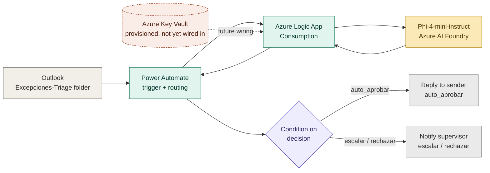

# Approval Exception Triage

**A portfolio project built to prove I can turn a real business judgment call into an auditable, AI-assisted automation — not just describe one.**

**Status:** ✅ End-to-end validated — all three decision branches (auto-approve, escalate, reject/escalate) tested and confirmed against the documented policy, trigger through notification.

## Why this project exists

I'm a Business Analyst transitioning into Data/Cloud Engineering, with a near-term focus on the BA + applied-AI intersection — it's the more reachable path in the short term than a pure Data Engineer role without formal experience. Reading about Power Automate or Azure AI Foundry isn't the same as being the person who has to figure out why a small model is silently ignoring half your prompt, or why a workflow that ran fine a minute ago suddenly times out.

**The scenario:** invoice/PO approval exceptions — price mismatches, missing POs, duplicate invoices — are a routine part of accounts-payable-adjacent BA work at companies like Abbott and P&G. Someone reads the exception, checks it against a few rules of thumb, and decides: approve it, escalate it, or reject it. This project takes that exact judgment call and expresses it as a documented, auditable automation, with an AI model doing the first pass and a human validating anything that isn't a clean approval.

**What this project demonstrates:**
- Designing a real business-process automation across two Microsoft tools (Power Automate + Azure Logic Apps), not just chaining prebuilt connectors
- Diagnosing a small language model silently discarding part of a prompt — caught via `prompt_tokens` in the raw API response, not guesswork
- Distinguishing a real infrastructure failure from a masked one (a rate-limit-triggered retry policy dressed up as a "timeout")
- Designing a safety rule (confidence-based override) that limits how much authority an AI model actually has in a decision pipeline
- Working through a real Azure quota constraint (student subscription, zero dedicated-compute quota) and adapting the architecture instead of stalling on it

## What was built

An email describing an invoice/PO exception, landing in a monitored Outlook folder, triggers a Power Automate flow that calls an Azure Logic App. The Logic App sends the exception to Phi-4-mini-instruct (Azure AI Foundry), which extracts structured fields and recommends a decision under a documented policy. The result is routed back through Power Automate: auto-approved cases get an automatic reply, everything else goes to a human for review.

**Key numbers:**
- 3 decision branches validated end-to-end (auto_aprobar / escalar / rechazar_o_escalar_alta_prioridad)
- ~3 second average execution time per Logic App run once the system was correctly configured
- $0.07 / $0.23 per million input/output tokens — the AI decision layer costs fractions of a cent per exception processed

## Results

The three validated test cases, using the policy table below:

| Scenario | Monto | Discrepancia | Decision | Confidence |
|---|---|---|---|---|
| Low amount, minimal discrepancy | $200 | 2% | `auto_aprobar` | 95% |
| Mid amount, moderate discrepancy | $650 | 8% | `escalar` | 90% |
| High amount, missing PO | $8,500 | n/a | `rechazar_o_escalar_alta_prioridad` | 90% |

Full test payloads and model outputs in [`sample-data/expected-outputs.json`](sample-data/expected-outputs.json).

**The one number that matters most isn't in that table:** the confidence-override rule (never auto-approve below 85% confidence) never had to fire during testing — but it exists specifically for the case where a small model is confidently wrong, which is a documented, known failure mode of models this size. The policy doesn't trust the model; it constrains it.

## Architecture



| Stage | What happens | Why |
|---|---|---|
| **Trigger** | Power Automate watches a dedicated Outlook folder for exception emails | Keeps the trigger isolated from normal inbox traffic and easy to filter |
| **Decision layer** | An Azure Logic App (Consumption) sends the exception to Phi-4-mini-instruct, parses the model's structured response, and applies the confidence-override rule | This is where the actual judgment call happens — and where it's made auditable instead of tacit |
| **Routing** | Power Automate reads the `decision` field and either auto-replies or notifies a human | The AI never has final say on anything but the cleanest cases |

The API key currently lives in the Logic App's HTTP action (Secure Inputs/Outputs enabled) rather than Key Vault — a Key Vault and the correct RBAC role assignment are provisioned, but not yet wired into the call itself. Full reasoning in [`docs/design-decisions.md`](docs/design-decisions.md).

## Repo structure

```
├── docs/                     # design decisions, data dictionary, retrospective, cost notes
├── flows/                    # sanitized Azure Logic App workflow definition
├── prompts/                  # the extraction/classification/decision prompt, with reasoning
└── sample-data/              # the three test cases validating each decision branch
```

## Key engineering decisions

- **Logic Apps Consumption, not Standard** — Standard requires dedicated-compute quota that the student subscription had set to zero; Consumption is serverless and billed per execution
- **Phi-4-mini-instruct via Serverless API, not Managed Compute** — avoids the same kind of GPU-hour quota wall, and costs roughly 35–40x less per token than a GPT-4o-class model for a task this size
- **System-role message dropped, fused into a single `user` message** — the endpoint was silently discarding `system`-role content; caught via an abnormally low `prompt_tokens` count in the raw response, not a visible error
- **Confidence-override rule** — the model's recommendation can be overridden by its own stated confidence; auto-approval is never issued below 85% confidence, regardless of what the amount/discrepancy rules alone would allow
- **Retry-policy-masked timeouts diagnosed by run-history timing, not assumption** — failed runs that took 2–4 minutes (versus a healthy ~3 seconds) pointed to hidden retries against a rate-limited endpoint, not a real connectivity problem — confirmed by testing the model directly, outside any flow
- **API key inline with Secure Inputs, Key Vault provisioned but not fully wired** — a deliberate, documented scope decision, not an oversight

### 🧰 Stack

Tools listed here were actually used and verified in this project — no badge without evidence in the repo.

**Cloud & Automation**
<p>
  
  
  
</p>

**AI / GenAI**
<p>
  
  
</p>

**Security**
<p>
  
  
</p>

**AI-Assisted Engineering**
<p>
  
  
  
</p>

Used for architecture/design discussion, and for hands-on diagnosis of two genuinely confusing failure modes: a model silently dropping part of its prompt, and a retry policy masking a rate limit as a timeout. The Power Automate side of the build was driven through a separate MCP connection in Claude Code, with each step validated before moving to the next — the same discipline used throughout the Logic App build.

**Tooling**
<p>
  
  
</p>

## What I gained

- Real, hands-on Azure Logic Apps and Power Automate experience — including hitting and resolving an actual subscription-quota wall, not a hypothetical one
- Practice diagnosing infrastructure failures using raw evidence (token counts, run-history timing) instead of guessing between "it's the model" and "it's the network"
- Firsthand experience with a documented small-model limitation (silent system-role dropping) that isn't obvious from documentation alone
- Practice designing a safety constraint (the confidence override) that limits AI authority in a decision pipeline, rather than assuming the model's output is the final word
- Basic RBAC/Managed Identity setup for Azure Key Vault, even though the full wiring is a documented next step rather than finished work

## What I would do differently

See [`docs/what-i-would-do-differently.md`](docs/what-i-would-do-differently.md).

## Author

Kendall Castro — [GitHub](https://github.com/KendallCW)
